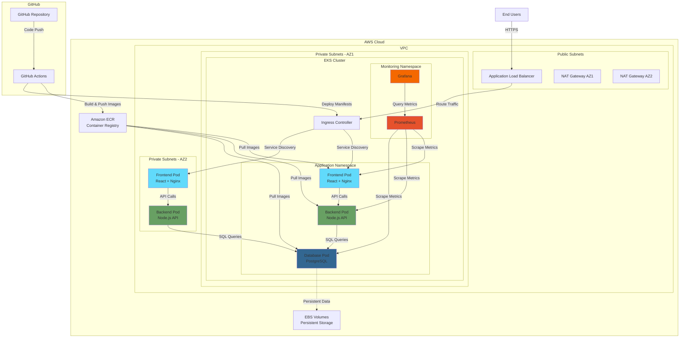
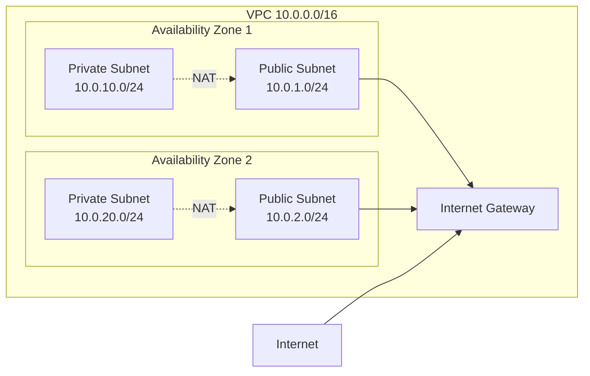
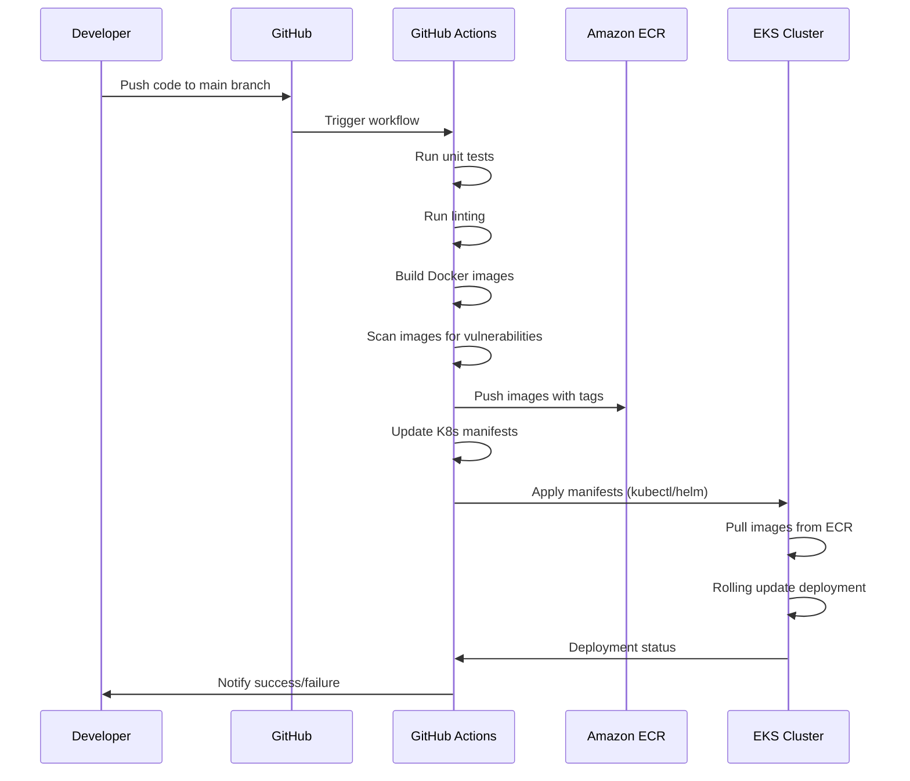

# Design Document

## Overview

This design document outlines the architecture and implementation approach for a production-grade three-tier e-commerce application deployed on AWS using modern DevOps practices. The system leverages Terraform for infrastructure as code, Amazon EKS for container orchestration, GitHub Actions for CI/CD automation, and Prometheus/Grafana for observability. The application follows a microservices architecture with clear separation between presentation (React frontend), business logic (Node.js API), and data persistence (PostgreSQL) layers.

## Architecture

### High-Level Architecture Diagram



### Network Architecture



### CI/CD Pipeline Flow



## Components and Interfaces

### 1. Infrastructure Layer (Terraform)

**Modules:**
- **VPC Module**: Creates VPC, subnets, route tables, NAT gateways, Internet gateway
- **EKS Module**: Provisions EKS cluster, node groups, IAM roles
- **ALB Module**: Creates Application Load Balancer, target groups, listeners
- **ECR Module**: Creates container repositories for each service
- **Security Groups Module**: Defines network access rules

**Key Resources:**
- VPC with CIDR 10.0.0.0/16
- 2 public subnets (10.0.1.0/24, 10.0.2.0/24)
- 2 private subnets (10.0.10.0/24, 10.0.20.0/24)
- EKS cluster version 1.28+
- Node group with t3.medium instances (min: 2, max: 5)
- Application Load Balancer with SSL/TLS termination

### 2. Application Layer

#### Frontend Service (React)

**Technology Stack:**
- React 18+
- Nginx as web server
- Axios for HTTP requests

**Container Specifications:**
- Base Image: node:18-alpine (build), nginx:alpine (runtime)
- Exposed Port: 80
- Environment Variables:
  - REACT_APP_API_URL: Backend service endpoint
  - REACT_APP_ENV: Environment identifier

**API Integration:**
- GET /api/products - Fetch product catalog
- GET /api/products/:id - Fetch product details
- POST /api/cart - Add items to cart
- POST /api/orders - Create new order

**Kubernetes Resources:**
- Deployment: 2 replicas
- Service: LoadBalancer type
- ConfigMap: Application configuration
- HPA: Scale 2-5 replicas based on CPU

#### Backend Service (Node.js/Express)

**Technology Stack:**
- Node.js 18+
- Express.js framework
- pg (PostgreSQL client)
- prom-client for metrics

**Container Specifications:**
- Base Image: node:18-alpine
- Exposed Port: 3000
- Environment Variables:
  - DATABASE_HOST: PostgreSQL service name
  - DATABASE_PORT: 5432
  - DATABASE_NAME: ecommerce
  - DATABASE_USER: From Kubernetes Secret
  - DATABASE_PASSWORD: From Kubernetes Secret
  - NODE_ENV: production

**API Endpoints:**
- GET /api/health - Health check endpoint
- GET /api/products - List all products
- GET /api/products/:id - Get product by ID
- POST /api/products - Create new product
- POST /api/orders - Create new order
- GET /api/orders/:id - Get order by ID
- GET /metrics - Prometheus metrics endpoint

**Kubernetes Resources:**
- Deployment: 2 replicas
- Service: ClusterIP type
- Secret: Database credentials
- ConfigMap: Application configuration
- HPA: Scale 2-5 replicas based on CPU

#### Database Service (PostgreSQL)

**Technology Stack:**
- PostgreSQL 15
- postgres_exporter for metrics

**Container Specifications:**
- Base Image: postgres:15-alpine
- Exposed Port: 5432
- Environment Variables:
  - POSTGRES_DB: ecommerce
  - POSTGRES_USER: From Kubernetes Secret
  - POSTGRES_PASSWORD: From Kubernetes Secret

**Schema:**
```sql
-- Products table
CREATE TABLE products (
    id SERIAL PRIMARY KEY,
    name VARCHAR(255) NOT NULL,
    description TEXT,
    price DECIMAL(10, 2) NOT NULL,
    image_url VARCHAR(512),
    stock_quantity INTEGER DEFAULT 0,
    created_at TIMESTAMP DEFAULT CURRENT_TIMESTAMP
);

-- Orders table
CREATE TABLE orders (
    id SERIAL PRIMARY KEY,
    customer_email VARCHAR(255) NOT NULL,
    total_amount DECIMAL(10, 2) NOT NULL,
    status VARCHAR(50) DEFAULT 'pending',
    created_at TIMESTAMP DEFAULT CURRENT_TIMESTAMP
);

-- Order items table
CREATE TABLE order_items (
    id SERIAL PRIMARY KEY,
    order_id INTEGER REFERENCES orders(id),
    product_id INTEGER REFERENCES products(id),
    quantity INTEGER NOT NULL,
    price DECIMAL(10, 2) NOT NULL
);
```

**Kubernetes Resources:**
- StatefulSet: 1 replica
- Service: ClusterIP type
- PersistentVolumeClaim: 20Gi EBS volume
- Secret: Database credentials

### 3. Monitoring Layer

#### Prometheus

**Configuration:**
- Scrape interval: 15s
- Retention: 15 days
- Storage: 50Gi persistent volume

**Scrape Targets:**
- Kubernetes nodes
- Kubernetes pods (via annotations)
- Frontend service metrics
- Backend service /metrics endpoint
- PostgreSQL exporter

**Alerting Rules:**
- Pod restart rate > 3 in 5 minutes
- CPU usage > 80% for 5 minutes
- Memory usage > 85% for 5 minutes
- API error rate > 5% for 2 minutes
- Database connection pool exhausted

**Kubernetes Resources:**
- Deployment: 1 replica
- Service: ClusterIP type
- ConfigMap: Prometheus configuration
- PersistentVolumeClaim: 50Gi

#### Grafana

**Configuration:**
- Data source: Prometheus (auto-configured)
- Admin credentials: From Kubernetes Secret

**Dashboards:**
1. **Cluster Overview Dashboard**
   - Node CPU/Memory usage
   - Pod count and status
   - Network I/O
   - Disk usage

2. **Application Dashboard**
   - Request rate per service
   - Response time (p50, p95, p99)
   - Error rate
   - Active connections

3. **Database Dashboard**
   - Connection pool status
   - Query performance
   - Transaction rate
   - Cache hit ratio

**Kubernetes Resources:**
- Deployment: 1 replica
- Service: LoadBalancer type
- ConfigMap: Dashboard definitions
- Secret: Admin credentials

### 4. CI/CD Pipeline (GitHub Actions)

**Workflow Triggers:**
- Push to main branch
- Pull request to main branch
- Manual workflow dispatch

**Workflow Jobs:**

1. **Test Job**
   - Checkout code
   - Setup Node.js
   - Install dependencies
   - Run ESLint
   - Run unit tests
   - Generate coverage report

2. **Build Job** (depends on Test)
   - Checkout code
   - Configure AWS credentials
   - Login to Amazon ECR
   - Build frontend Docker image
   - Build backend Docker image
   - Build database Docker image
   - Tag images with commit SHA and latest
   - Push images to ECR
   - Run Trivy security scan

3. **Deploy Job** (depends on Build)
   - Checkout code
   - Configure AWS credentials
   - Update kubeconfig for EKS
   - Update Kubernetes manifests with new image tags
   - Apply manifests using kubectl
   - Wait for rollout completion
   - Verify deployment health

**Secrets Required:**
- AWS_ACCESS_KEY_ID
- AWS_SECRET_ACCESS_KEY
- AWS_REGION
- EKS_CLUSTER_NAME
- ECR_REGISTRY

## Data Models

### Product Model

```typescript
interface Product {
  id: number;
  name: string;
  description: string;
  price: number;
  imageUrl: string;
  stockQuantity: number;
  createdAt: Date;
}
```

### Order Model

```typescript
interface Order {
  id: number;
  customerEmail: string;
  totalAmount: number;
  status: 'pending' | 'processing' | 'completed' | 'cancelled';
  createdAt: Date;
  items: OrderItem[];
}

interface OrderItem {
  id: number;
  orderId: number;
  productId: number;
  quantity: number;
  price: number;
}
```

### Configuration Models

```typescript
// Frontend Configuration
interface FrontendConfig {
  apiUrl: string;
  environment: string;
}

// Backend Configuration
interface BackendConfig {
  database: {
    host: string;
    port: number;
    name: string;
    user: string;
    password: string;
  };
  server: {
    port: number;
    corsOrigins: string[];
  };
}
```

## Correctness Properties

*A property is a characteristic or behavior that should hold true across all valid executions of a system—essentially, a formal statement about what the system should do. Properties serve as the bridge between human-readable specifications and machine-verifiable correctness guarantees.*

### Property 1: Image tagging consistency
*For any* Docker image build, the resulting image SHALL be tagged with both a version number and the commit SHA identifier.
**Validates: Requirements 2.4**

### Property 2: Deployment health verification
*For any* deployment to the EKS Cluster, all pods SHALL be in running and healthy state before the deployment is marked as successful.
**Validates: Requirements 3.5**

### Property 3: Internal service discovery
*For any* frontend pod in the EKS Cluster, it SHALL be able to reach the backend service using Kubernetes internal DNS service discovery.
**Validates: Requirements 4.2**

### Property 4: Database network isolation
*For any* pod that is not a backend service pod, it SHALL NOT be able to establish a connection to the database service.
**Validates: Requirements 4.3**

### Property 5: Network policy enforcement
*For any* network traffic within the cluster, it SHALL only be allowed if it follows the three-tier architecture pattern (users → frontend → backend → database).
**Validates: Requirements 4.5**

### Property 6: Frontend configuration loading
*For any* frontend service startup, it SHALL successfully load configuration from environment variables including the backend service URL.
**Validates: Requirements 5.4**

### Property 7: API error handling with retry
*For any* failed API call from the frontend, the system SHALL display a user-friendly error message and attempt to retry the request.
**Validates: Requirements 5.5**

### Property 8: Product listing API behavior
*For any* GET request to /api/products, the backend SHALL return a list of all products retrieved from the database service.
**Validates: Requirements 6.1**

### Property 9: Order creation persistence
*For any* valid POST request to /api/orders, the backend SHALL create a new order record in the database and return the created order.
**Validates: Requirements 6.2**

### Property 10: Database connection from secrets
*For any* backend service startup, it SHALL establish a database connection pool using credentials retrieved from Kubernetes Secrets.
**Validates: Requirements 6.3**

### Property 11: Database error handling
*For any* failed database query, the backend SHALL return an appropriate HTTP error code (5xx) and log the error details.
**Validates: Requirements 6.4**

### Property 12: SQL injection prevention
*For any* backend API request with user input, the system SHALL validate and sanitize parameters to prevent SQL injection attacks.
**Validates: Requirements 6.5**

### Property 13: Metrics endpoint exposure
*For any* running service (frontend, backend, database), it SHALL expose a metrics endpoint that Prometheus can successfully scrape.
**Validates: Requirements 7.2**

### Property 14: Automatic service discovery
*For any* new service deployed to the cluster, Prometheus SHALL automatically discover and begin scraping its metrics endpoint.
**Validates: Requirements 7.5**

### Property 15: Secrets retrieval security
*For any* component requiring database credentials, it SHALL retrieve them from Kubernetes Secrets and NOT from environment variables or hardcoded values.
**Validates: Requirements 9.1**

### Property 16: Image layer security
*For any* built Docker image, it SHALL NOT contain secrets or credentials in any image layer.
**Validates: Requirements 9.3**

### Property 17: Database connection encryption
*For any* connection from the backend to the database, it SHALL use TLS encryption.
**Validates: Requirements 9.4**

### Property 18: CI/CD credential security
*For any* GitHub Actions workflow execution, AWS credentials SHALL be retrieved from GitHub Secrets and SHALL NOT be logged in workflow output.
**Validates: Requirements 9.5**

### Property 19: Multi-replica deployment
*For any* deployment of the frontend or backend service, it SHALL be configured with at least 2 replicas for high availability.
**Validates: Requirements 10.2**

### Property 20: Pod self-healing
*For any* pod that fails health checks, Kubernetes SHALL automatically restart the pod and remove it from the service load balancer until healthy.
**Validates: Requirements 10.3**

### Property 21: Load balancer health checking
*For any* target instance behind the Application Load Balancer, if it becomes unhealthy, the ALB SHALL remove it from the target group.
**Validates: Requirements 10.4**

### Property 22: Data persistence across restarts
*For any* database pod restart, all data SHALL be preserved through persistent volumes with no data loss.
**Validates: Requirements 10.5**

### Property 23: Structured logging to stdout
*For any* service (frontend, backend, database), it SHALL write structured logs to stdout for collection by Kubernetes.
**Validates: Requirements 11.1**

### Property 24: Log format completeness
*For any* log entry written by the system, it SHALL include a timestamp, log level, and contextual information such as request IDs.
**Validates: Requirements 11.2**

### Property 25: Error logging without sensitive data
*For any* error that occurs, the system SHALL log stack traces and error details while ensuring no sensitive information is exposed.
**Validates: Requirements 11.4**

### Property 26: Request logging completeness
*For any* request processed by the backend, it SHALL log the request method, path, status code, and response time.
**Validates: Requirements 11.5**

### Property 27: Container vulnerability scanning
*For any* Docker image built in the CI/CD pipeline, it SHALL be scanned for security vulnerabilities before deployment.
**Validates: Requirements 12.3**

### Property 28: Pipeline failure handling
*For any* test failure in the CI/CD pipeline, the system SHALL halt the deployment process and notify developers.
**Validates: Requirements 12.4**

### Property 29: Pipeline success progression
*For any* successful test execution, the CI/CD pipeline SHALL proceed to build and push Docker images to Amazon ECR.
**Validates: Requirements 12.5**

## Error Handling

### Infrastructure Errors

**Terraform Failures:**
- Validate AWS credentials before applying configuration
- Use terraform plan to preview changes
- Implement state locking to prevent concurrent modifications
- Store state remotely in S3 with versioning enabled
- Implement retry logic for transient AWS API errors

**EKS Cluster Issues:**
- Monitor cluster health using AWS CloudWatch
- Implement node auto-scaling for capacity issues
- Configure pod disruption budgets to prevent service interruption
- Use cluster autoscaler for dynamic node provisioning

### Application Errors

**Frontend Errors:**
- Implement error boundaries to catch React component errors
- Display user-friendly error messages for API failures
- Implement exponential backoff for API retries
- Log errors to browser console for debugging
- Provide fallback UI for critical failures

**Backend Errors:**
- Implement global error handler middleware
- Return appropriate HTTP status codes (400, 404, 500, etc.)
- Log all errors with stack traces
- Implement circuit breaker pattern for database connections
- Use connection pooling with retry logic

**Database Errors:**
- Implement connection retry with exponential backoff
- Use read replicas for high availability (future enhancement)
- Configure automatic backups with point-in-time recovery
- Monitor connection pool exhaustion
- Implement query timeouts to prevent long-running queries

### Deployment Errors

**CI/CD Pipeline Failures:**
- Fail fast on test failures
- Implement rollback mechanism for failed deployments
- Send notifications to Slack/email on pipeline failures
- Preserve previous working images in ECR
- Use Kubernetes rolling updates to minimize downtime

**Container Errors:**
- Implement health checks (liveness and readiness probes)
- Configure restart policies for failed containers
- Set resource limits to prevent resource exhaustion
- Use init containers for dependency checks
- Implement graceful shutdown handlers

## Testing Strategy

### Unit Testing

**Backend Unit Tests:**
- Test individual API endpoints with mocked database
- Test database query functions with test database
- Test input validation and sanitization logic
- Test error handling and edge cases
- Use Jest as testing framework
- Target: 80% code coverage

**Frontend Unit Tests:**
- Test React components with React Testing Library
- Test API integration with mocked responses
- Test state management logic
- Test error handling and loading states
- Use Jest and React Testing Library
- Target: 70% code coverage

### Property-Based Testing

**Testing Framework:**
- Use fast-check for JavaScript/TypeScript property-based testing
- Configure each property test to run minimum 100 iterations
- Tag each property test with corresponding design property number

**Property Test Implementation:**
- Each correctness property SHALL be implemented as a single property-based test
- Tests SHALL use format: `// Feature: aws-devops-three-tier, Property X: [property text]`
- Generate random valid inputs to verify properties hold across all cases
- Focus on invariants, round-trip properties, and metamorphic properties

**Key Property Tests:**
- Image tagging: Verify all built images have version and SHA tags
- Service discovery: Verify frontend can always reach backend by DNS name
- Network isolation: Verify unauthorized pods cannot reach database
- Secrets security: Verify no secrets in image layers or logs
- Health checks: Verify unhealthy pods are removed from service
- Logging format: Verify all logs contain required fields

### Integration Testing

**End-to-End Tests:**
- Test complete user flows (browse products, create order)
- Test frontend-backend-database integration
- Test authentication and authorization flows
- Use Playwright or Cypress for E2E testing
- Run in staging environment before production

**Infrastructure Tests:**
- Use Terratest to validate Terraform configurations
- Test EKS cluster connectivity and node health
- Test load balancer routing and health checks
- Verify network policies and security groups
- Test backup and restore procedures

### Security Testing

**Container Security:**
- Scan images with Trivy for vulnerabilities
- Fail builds on high/critical vulnerabilities
- Regularly update base images
- Use minimal base images (alpine)

**Penetration Testing:**
- Test for SQL injection vulnerabilities
- Test for XSS vulnerabilities in frontend
- Test authentication and authorization
- Test API rate limiting and DDoS protection

### Performance Testing

**Load Testing:**
- Use k6 or Artillery for load testing
- Test API endpoints under expected load
- Test database query performance
- Identify bottlenecks and optimize
- Test auto-scaling behavior

**Monitoring and Observability:**
- Monitor application metrics in Grafana
- Set up alerts for performance degradation
- Track response times and error rates
- Monitor resource utilization

## Deployment Strategy

### Rolling Deployment

- Use Kubernetes rolling updates for zero-downtime deployments
- Configure maxUnavailable: 1 and maxSurge: 1
- Implement readiness probes to ensure new pods are healthy
- Automatic rollback on deployment failure

### Blue-Green Deployment (Future Enhancement)

- Maintain two identical environments
- Route traffic to new version after validation
- Quick rollback by switching traffic back

### Canary Deployment (Future Enhancement)

- Deploy new version to small subset of users
- Monitor metrics and error rates
- Gradually increase traffic to new version
- Rollback if issues detected

## Security Considerations

### Network Security

- Use private subnets for EKS worker nodes
- Implement network policies to restrict pod-to-pod communication
- Use security groups to control traffic at instance level
- Enable VPC flow logs for network monitoring

### Access Control

- Use IAM roles for service accounts (IRSA)
- Implement RBAC in Kubernetes
- Use least privilege principle for all permissions
- Rotate credentials regularly

### Data Security

- Encrypt data at rest using EBS encryption
- Encrypt data in transit using TLS
- Use Kubernetes Secrets for sensitive data
- Enable encryption for Terraform state files

### Compliance

- Implement audit logging for all API calls
- Monitor and alert on suspicious activities
- Regular security assessments and updates
- Follow AWS Well-Architected Framework

## Scalability Considerations

### Horizontal Scaling

- Use Horizontal Pod Autoscaler (HPA) for application pods
- Configure cluster autoscaler for EKS nodes
- Scale based on CPU, memory, or custom metrics
- Set appropriate min/max replica counts

### Vertical Scaling

- Right-size instance types based on workload
- Use larger instances for database workloads
- Monitor resource utilization and adjust

### Database Scaling

- Implement connection pooling
- Use read replicas for read-heavy workloads (future)
- Consider Amazon RDS for managed PostgreSQL (future)
- Implement caching layer with Redis (future)

## Maintenance and Operations

### Backup and Recovery

- Automated daily backups of database
- Backup Terraform state files
- Document recovery procedures
- Test backup restoration regularly

### Monitoring and Alerting

- Monitor all infrastructure and application metrics
- Set up alerts for critical issues
- Create runbooks for common issues
- Implement on-call rotation

### Updates and Patches

- Regular updates of base images
- Kubernetes version upgrades
- Security patches applied promptly
- Scheduled maintenance windows

